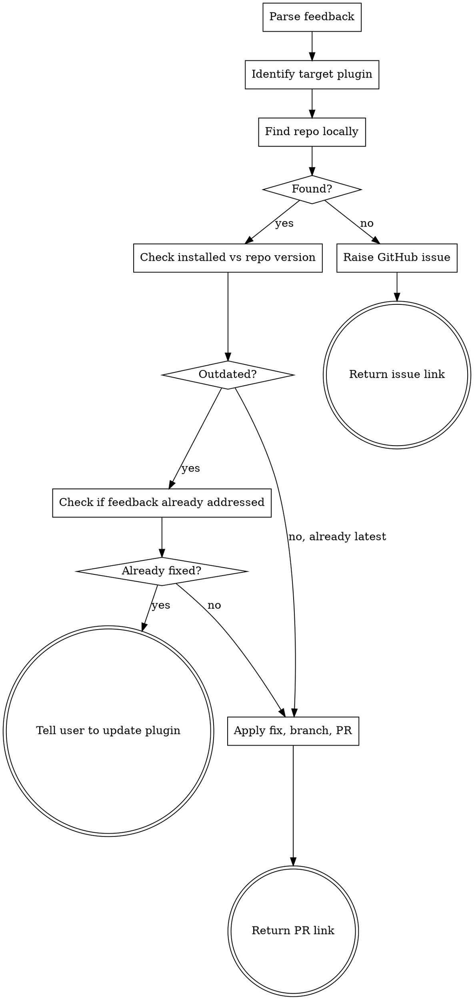

# Marketplace Feedback

Act on feedback about any Leolebleis plugin. Find the correct repo, check if the issue is already fixed, and either apply the fix or raise an issue.

## Known Plugins

| Plugin | GitHub | Description |
|--------|--------|-------------|
| claude-meta-toolkit | `Leolebleis/claude-meta-toolkit` | Observability, session hooks, marketplace maintenance |
| claude-marketplace | `Leolebleis/claude-marketplace` | Personal skills (french-writing, google-tasks, pc-performance-audit) |

## Flow



## Step 1: Parse the Feedback

Identify from the user's message:
- **What's affected:** which skill, hook, config, or behavior
- **What's wrong:** not triggering, wrong behavior, missing feature, wording too weak, etc.
- **Severity:** is this a bug (broken behavior) or an improvement (could be better)

## Step 2: Identify the Target Plugin

Match the affected skill/hook/config to a plugin from the Known Plugins table above. Use the skill name, hook name, or context from the user's message.

If ambiguous, ask: "Is this about [plugin A] or [plugin B]?"

## Step 3: Find the Repo Locally

Search for the target plugin's repo in this order (stop at first match):

1. `~/Documents/code/<plugin-name>/`
2. `~/code/<plugin-name>/`
3. `~/<plugin-name>/`
4. Broader search: `find ~ -maxdepth 3 -name "marketplace.json" -path "*/.claude-plugin/*" 2>/dev/null`

**Validation:** The found directory must contain `.claude-plugin/marketplace.json` where the `plugins[].name` field matches the target plugin name.

If found, proceed to Step 4. If not found, skip to Step 6.

## Step 4: Check Version Currency

Compare the **installed plugin version** against the **repo version**:

- **Installed version:** Read from the plugin cache. The cache path follows the pattern `~/.claude/plugins/cache/<source>/<plugin-name>/<version>/`. Check `marketplace.json` inside the cache directory.
- **Repo version:** Read `.claude-plugin/marketplace.json` in the local repo.

If the installed version is behind the repo version:
1. Run `git log --oneline v<installed>..HEAD` (or compare recent commits) to see what changed
2. Read the changed files relevant to the feedback
3. If the feedback is already addressed by those changes, tell the user:
   > "This looks like it was already fixed in version X.Y.Z (you're on A.B.C). Run `claude plugin update Leolebleis/<plugin-name>` to get the fix."
4. Stop here -- do not create a PR for something already fixed.

If versions match or the fix isn't in the diff, proceed to Step 5.

## Step 5: Apply the Fix

### Prepare

```bash
cd <repo-path>
git checkout main && git pull origin main
git checkout -b fix/<descriptive-branch-name>
```

### Identify and apply changes

Based on what's affected:

| Affected | Files to check | Action |
|----------|---------------|--------|
| A skill's behavior | `skills/<name>/SKILL.md` | Edit the skill. **Invoke `/writing-skills`** for guidance. |
| A skill's trigger | `skills/<name>/SKILL.md` frontmatter | Update the `description` field |
| Session hook guidance | `hooks/md-hygiene.md` | Edit trigger rules or wording |
| Hook mechanics | `hooks/session-start`, `hooks/hooks.json` | Edit hook scripts |
| Plugin config | `.claude-plugin/marketplace.json` | Edit as needed |

**Coherence check:** After making the primary change, check if any of these also need updating:
- `hooks/md-hygiene.md` (if a new skill was added or trigger changed)
- `README.md` (if a skill was added, removed, or renamed)
- `CLAUDE.md` (if the skills table needs updating)

### Bump version

In `.claude-plugin/marketplace.json`:
- **Patch** (X.Y.Z+1): fix to existing skill, hook wording, config tweak
- **Minor** (X.Y+1.0): new skill added, significant new capability

### Commit, push, PR

```bash
git add -A
git commit -m "fix: <concise description of what was fixed and why>"
git push -u origin fix/<branch-name>
gh pr create --repo Leolebleis/<plugin-name> \
  --title "<concise title>" \
  --body "$(cat <<'EOF'
## Summary
- <what feedback was received>
- <what was changed to address it>

## Changed files
- <list of modified files>

## Version
X.Y.Z -> X.Y.Z+1
EOF
)"
```

**Return the PR link to the user.**

## Step 6: Raise a GitHub Issue (repo not found)

If the repo isn't on the local machine:

```bash
gh issue create --repo Leolebleis/<plugin-name> \
  --title "<concise description of the feedback>" \
  --body "$(cat <<'EOF'
## Feedback
<what the user reported, in full context>

## Affected
<which skill/hook/config>

## Suggested fix
<what should change, based on your analysis>

## Context
Filed automatically by marketplace-feedback skill.
Repo not found on local machine -- manual fix required.
EOF
)"
```

Tell the user:
> "I couldn't find the <plugin-name> repo on this machine, so I raised an issue instead: <issue link>. You can apply the fix from a session where the repo is available."

## Important

- **Never push directly to main.** Always branch and PR.
- **Always bump the version.** Every change to a plugin gets a version increment.
- If modifying a skill, invoke `/writing-skills` for quality guidance.
- After creating or modifying a skill, suggest `/skill-creator` to quality-check it (per session guidance).
